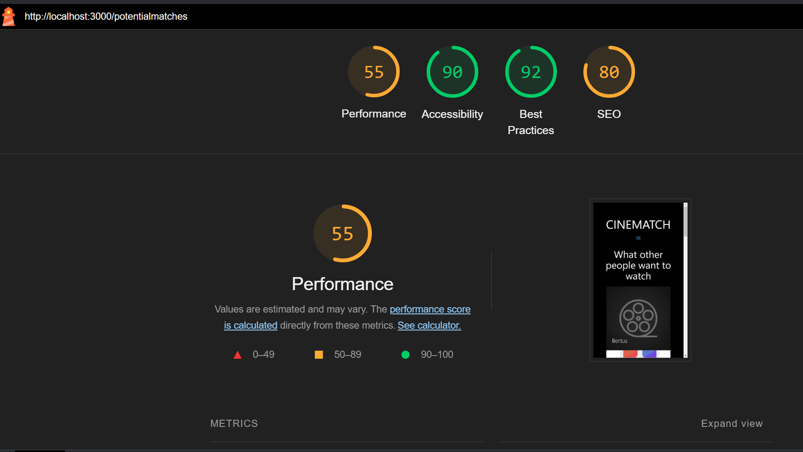
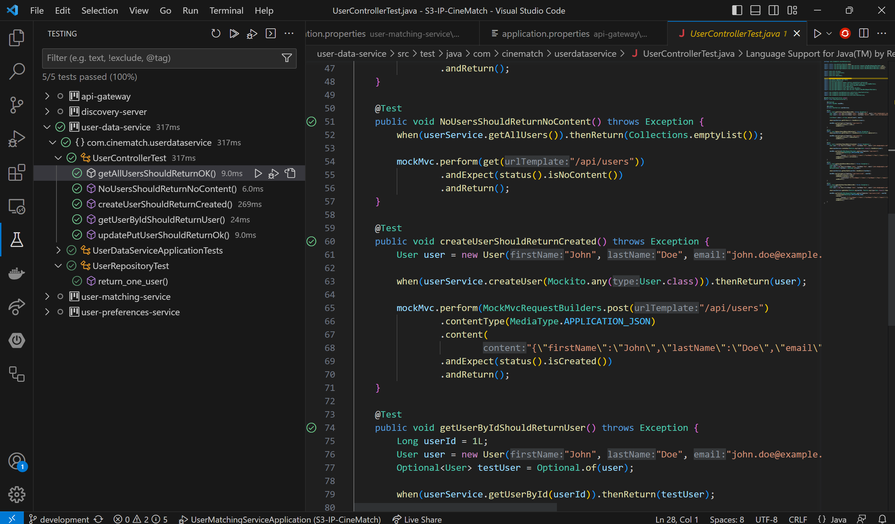
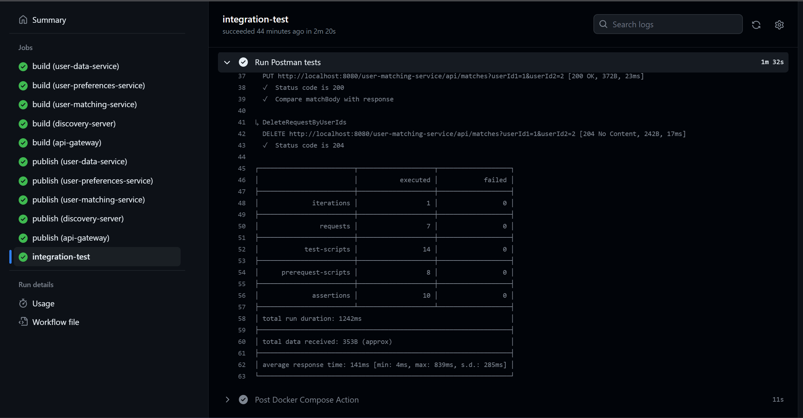
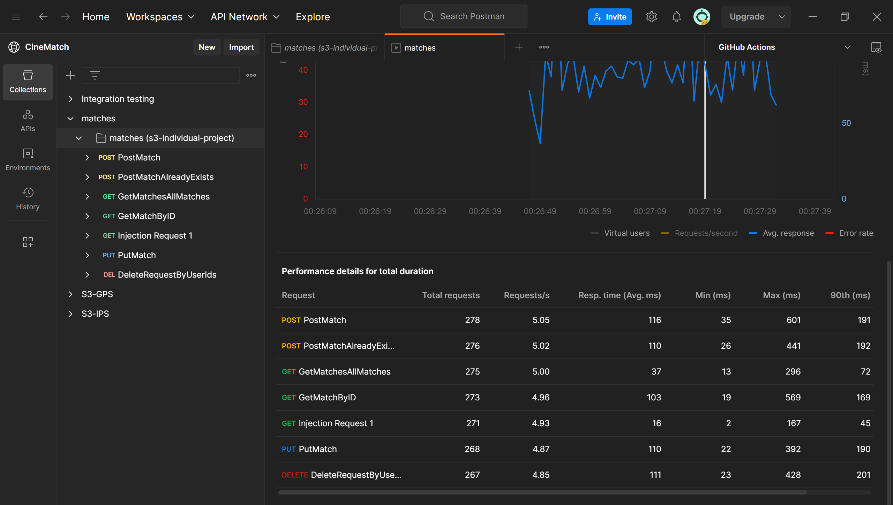

Although some of the testing is more like a proof of concept, I made sure to use different microservices for different tests to showcase that they are all correctly configured.

A tool I used for a majority of the testing that I did (security, integration and load testing) is Postman[^1]. You can find the tests that I wrote for the SQL-injection and integration tests in my Postman workspace. 

[**CineMatch workspace**](https://www.postman.com/mschippers/workspace/cinematch/overview) 🏤

## Test Strategies

### Manually
- **Usability testing:** I was able to conduct a single usability test during the semester. All of the details of that test can be read here: [**Usability Test**](../CineMatch/WebApplication_InPractice.md#63-usability-test).
- **Security testing:** 
	- During my research on identification and authentication failures, I conducted a credential stuffing attack after implementing Keycloak (I did not have any kind of user-management within my application before this). Details can be read here: [**Security Research**](../Research/Security_Research_Identification_and_Authentication_Failures.md). 
	- I also made sure to write a SQL-injection test, which I added to the routine of the integration tests. Basically I made one of the userId values the following code: ```
```javascript
function() {var date=new Date(); do{curDate = new Date();}while(curDate-date<10000); }
```
Which introduces an intentional delay of 10 seconds (10000 milliseconds) before the response is sent. This delay is achieved using a loop that continuously checks the current date until 10 seconds have passed. The purpose of adding such delay is useful to simulate a slow server response or to test the behavior of the client application when dealing with longer response times. However, my API handles this correctly and simply returns a 400 Bad Request response.

- **Performance testing**: I made use of Google Lighthouse to consult the performance of my application. To my surprise, it actually scored surprisingly well. Due to its features of finding potential bottlenecks inside the application, I also used this as an example in my [**Concurrency research**](../Research/Concurrency_Research.md). A lot of the performance has actually to do with the Materialize dependencies. It gave me reassurance that I was on the right track with implementing best practices. Below is a screenshot of its general score. 

### Automated
- **Code Quality testing:** As I mentioned in the [**CI/CD section**](../#23-cicd-lo4), I added SonarCloud to my workflow files to help me improve the quality of my code. SonarCloud has been super helpful in finding issues like code smells, bugs, and other problems in my code. It's like having a mentor who points out areas where I can make my code better with a great user interface and helpful tips. Because it helps and promotes writing clean code, I also added this suggestion to my [**Concurrency research**](../Research/Concurrency_Research.md) as clean code is a very important step in achieving concurrency.
- **Unit testing:** I wrote unit tests for just the user-data-service controller class as a proof of concept, the screenshot below shows that they all pass. Although automated unit testing is enabled for both repositories, only the backend actually has tests to conduct. The other 4 services do have one test which asserts if the context is not null and the project can be build. In the case of unit testing the service or controller, it turned out to be much more efficient to use integration testing for this instead, as I am testing a much bigger piece of the application this way, without having to mock anything.

*Screenshot of unit tests passing for the user-data-service controller.*

- **Integration testing:** I wrote integration tests for the user-matching-service API and added an automated test to the CI-pipeline. Below is a screenshot of a successful integration test. 
- **Load testing:** Postman also made it possible to do load testing by simulating traffic. In my example below, I added 20 fixed users accessing the same resources. Although my tests aren't really effective for load testing, as the tests for matching basically just create the same match between two ids over and over again. The screenshot shows mostly error responses, which is mostly due to the injection test which is supposed to return an error/bad request. 

### End-to-End testing

Unfortunately I was unable to write end-to-end tests due to time constraints and since the frontend is not fully functional. However, I know it is possible to do it by using Cypress (a very popular tool for end-to-end tests). End-to-end tests basically simulate one user flow within an application. In my case, a good example would be setting preferences or editing preferences. Almost like an automatic version of conducting an usability test.

[^1]: See [Postman](https://www.postman.com/)
[^2]: See [Cypress](https://docs.cypress.io/guides/overview/why-cypress)