# A FULL STACK WEB APPLICATION: CineMatch 
Working with a full stack application and applying UX (IPS)


## Table of Contents
- [1. Introduction](#1-introduction)
- [2. Frontend](#2-frontend)
	- [2.1 Why React](#21-why-react)
	- [2.2 Materialize](#22-materialize)
	- [2.3 Final result](#23-final-result)
- [3. Distributed Communication](#3-distributed-communication)
	- [3.1 Concurrency within CineMatch](#31-concurrency-within-cinematch)
	- [3.2 Using REST](#32-using-rest)
- [4. Backend](#4-backend)
	- [4.1 Microservices with Spring Boot](#41-microservices-with-spring-boot)
		- [4.1.1 Future plans](#411-future-plans)
	- [4.2 Gateway and Keycloak](#42-gateway-and-keycloak)
	- [4.3 API Documentation](#43-api-documentation)
- [5. Data persistence](#5-data-persistence)
	- [5.1 SQL and NoSQL databases](#51-sql-and-nosql-databases)
	- [5.2 Testing with different databases](#52-testing-with-different-databases)
	- [5.3 Hibernate (ORM)](#53-hibernate-orm)
	- [5.4 Movies and cinema data](#54-movies-and-cinema-data)
- [6. User Experience](#6-user-experience)
	- [6.1 Heuristics of choice](#61-heuristics-of-choice)
	- [6.2 Finding the right design](#62-finding-the-right-design)
	- [6.3 Usability test](#63-usability-test)

## 1. Introduction
This document is structured to feature everything I have done for **Learning Outcome 01: Web
Application** during the IPS course. I spend most of the semester on the backend and data persistence, as it required a lot of work and I was also very new to the technologies. 

I used footnotes to add any additional information on sources I have used. 

Bold and underlined text in the paragraphs is clickable and will take you to the referenced section.

## 2. Frontend
In this section, I talk about my work on the frontend application of CineMatch, my reasoning behind using React, the design framework Materialize which I used and the challenges that I faced while working on the frontend. 

I feel somewhat disappointed with the final result of the frontend as it lacks functionality and the design I wanted to achieve. I realised that I became heavily invested in the backend development and user experience aspects, unintentionally neglecting the proper configuration and adjustments needed for the frontend. As a result, it ended up being a bit messy, empty and not up to the standard I had aimed for.

### 2.1 Why React
I chose to use React with simple JavaScript for the frontend of CineMatch. This is because I had already worked a little bit with Vue before and Angular seemed to have a higher learning curve than React. As mentioned in my [**Reflection**](../#41-what-went-well), I wanted to use as many new technologies as possible during this semester. Although React also supports the use of TypeScript, I did not feel confident enough to work with it so I went with JavaScript instead. React's flexibility in adding dependencies and its lightweight nature without a heavy webpack configuration also made it less intimidating to use than Angular.

The internet is full of great tutorials to learn React and I also did a whole bunch of them to get better at it. One tutorial that proved particularly valuable was by instructor Emmanuel Henri on LinkedIn Learning. His course on "Building Full-Stack Apps with React and Spring"[^1] served as a the real starting point for me in learning React.

Another helpful tutorial I found was by ASMR Prog on YouTube, where they created a small movie guide application that retrieves data from OMDb, the Open Movie Database[^2]. This tutorial was especially relevant to my project, CineMatch, as I had just been researching the possibilities of fetching movie data from a (free) movie API. The only thing required to get it to work is by requesting an API key.

### 2.2 Materialize
Materialize was used in one of the tutorials and showcased its ability to quickly create visually appealing and functional components. This got me interested. It was easy to set up and get it working. While working with it, I discovered some extra benefits:

- **Easy to Style:** The components are able to be customized. This is not always the case for components created by external design libraries. 
- **Responsive Design:** The framework promotes responsiveness, making it easy for the application to adapt well to different screen sizes and devices.
- **Consistent and Modern Design:** Materialize follows the principles of Material Design, which provides a modern and consistent look and feel across the application. This is especially important for the aspect of "**Consistency and standards**" in user experience, see [**Heuristics of choice**](#61-heuristics-of-choice) for more information about it.
- **Great Documentation and Support:** Materialize offers detailed documentation and an active community, making it easier to find resources, examples, and assistance when encountering challenges. 

### 2.3 Final result 
As mentioned earlier, I know that the frontend falls short of expectations. However, I still want to share what the end result looks like, based on the wireframes and mock-up that I made, even though it may not be something to be proud of.

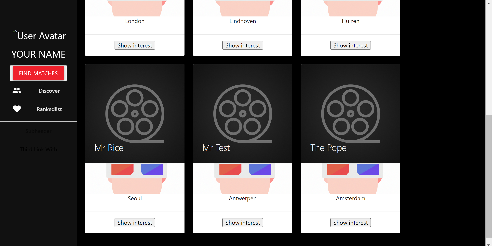
*The frontend features a convenient, collapsible and fully functional side-nav. On the right, we can see all the users and their data (movie preference (for now a standard image, just like the profile picture), name, location).*

Similar to what I mentioned in the [**User Experience**](6-user-experience) section, I think the *splitting of user stories by interface* technique might help me mitigate these challenges in the future. By being "forced" to deliver a (half) functional UI alongside other elements, it becomes less likely for the balance between frontend and backend to become uneven.

## 3. Distributed Communication
Distributed communication was the toughest for me among the five elements of web development. To gain a better understanding of it, I focused my second research on concurrency. This research provided great insights into how different modules interact and impact each other, but was still quite complex. In the rest of this section, I talk about how I worked with distributed communication within CineMatch.

### 3.1 Concurrency within CineMatch
In CineMatch, I was able to achieve a little bit of concurrency by using keywords such as async/await in the frontend, which allows for asynchronous operations. Additionally, the microservices architecture that I made for CineMatch helped a lot in promoting concurrency. By breaking down the system into smaller, independent services, it became easier to parallelize and distribute tasks, thereby improving overall performance. For communication between the services I used REST (Representational State Transfer) which is beneficial for concurrent communication between different components of the system, because they are stateless.

### 3.2 Using REST
Note: This section discusses **how** I implemented REST. To read more about **why** I used REST, please read the detailed description in the [**Project Analysis section about using REST**](../CineMatch/Project_Analysis.md#23-using-rest). 

I used Swagger/Open API (since the latest version), a popular tool for API documentation, to document and describe the RESTful endpoints in CineMatch. This helped making everything visual and easier to understand. More information about how I used Swagger can be found in the section [**API Documentation**](#43-api-documentation), which also leads to how it can be accessed.

The ResponseEntity object in Java allows for the manipulation of HTTP response codes, as can be seen in the code snippet below:
```java
    @Operation(summary = "Get a particular set of preferences by userId")
    @GetMapping("/{userid}")
    // Possible responses (this will be shown in the documentation)
    @ApiResponse(responseCode = "200", description = "Successfully found a set of preferences")
    @ApiResponse(responseCode = "404", description = "No preferences found")
    ResponseEntity<UserPreferences> findById(@PathVariable Long userid) {
        UserPreferences result = service.getOneSetOfUserPreferencesById(userid);
        if (result != null) {
            return ResponseEntity.ok(result);
        } else {
            return ResponseEntity.notFound().header("Description", "No match with id " + userid + " could be found.")
                    .build();
        }
    }
```
*Code snippet of the UserPreferences Controller. The @ApiResponse annotation adds extra information about the responses to be expected.*

Some extra important notes:
- **Maturity level:** The screenshot provided in [**API Documentation**](#43-api-documentation) section proves the maturity of the APIs to be level 2.
- **Testing:** As mentioned in the [**Backend part of the CI/CD section of the Reader's Guide**](../#232-Backend), the user-matching API contains automated integration tests to ensure the working of the endpoints. These return the correct HTTP response codes. 

## 4. Backend
This semester, I took on the challenge of building a complex backend using Spring Boot with Java. It was an opportunity for me to dive into new concepts and technologies, especially when I decided to build a microservices architecture. The books I am currently reading, The Pragmatic Programmer and Clean Code, both feature Java-based examples and since I have worked a lot with C# in the past, it seemed to be the right decision to use Java for the backend. I probably spend most of the semester on building the backend, but it paid off as it eventually came out successful and is fully functional.


### 4.1 Microservices with Spring Boot
Spring Boot has a low learning curve and provides a wide range of features that simplify development, making it easier for me to get started, especially since I was new to Java. There are also a lot of great tutorials out there to help you get started. For my project, the tutorial on microservices by Java Brains was especially important[^3].

The backend architecture of CineMatch consists of five microservices, each serving a specific purpose within the application. The core microservices include _user-data_, _user-preferences_, and _user-matching_. These services handle user-related data and the matching algorithm. In addition to these core microservices, the architecture also required two additional services: the *api-gateway* and a *discovery server*. These services are needed for the routing and 'finding' of the microservices. 

In the last semester, the group project consisted of just three services: frontend, backend and an additional service for scraping information. I learned the concept of distributed web applications, but other concepts associated with distributed web applications, like scalability were still a bit vague to me. This is why I decided to use a microservices architecture.

The microservices architecture provided me with new insights in why a stable architecture is important, it revealed details to me that I initially missed with other projects. By making smaller services, the idea of scalability, maintainability, and separation of concerns becomes much more clear and I learned a lot from that.

Overall, building the backend with Spring Boot and using a microservices architecture was a big learning opportunity for me and allowed me to explore new concepts and technologies while working with Java. 

#### 4.1.1 Future plans

If I had more time, I would have added two additional services: One service would be Movie-Data-Service and the other one Cinema-Data-Service. I planned to develop a Python-based web scraper, which would retrieve data from cinema websites based on user-entered cinema names. A small attempt I did at making this a reality is by successfully configuring a demo to use OMDb to retrieve movie data. 

### 4.2 Gateway and Keycloak

Although the API gateway technically is not required, it is better for security and load balancing. The gateway can take care of security by handling authentication and authorization, protecting the microservices from unauthorized access. It is able to do its job in load balancing by distributing incoming requests across multiple instances of the microservices to optimize performance and handle increased traffic effectively. 

The API gateway in my application delegates the authentication and authorization to Keycloak, which is properly configured. However, as mentioned in the [**Backend part of the CI/CD section of the Reader's Guide**](../#232-Backend), this caused some issues in the CI-pipeline and required Testcontainers in order to work, which I did not have time for to implement. As a result, Keycloak is disabled for the final submission of this project to properly showcase the application. 
You can read more about my experience with Keycloak in my [**Security Research**](../Research/Security_Research_Identification_and_Authentication_Failures.md) starting under the section [**Possible solution: Using a Single Sign-On Service**](../Research/Security_Research_Identification_and_Authentication_Failures.md#5-possible-solution-using-a-single-sign-on-service).

### 4.3 API Documentation
In the [**README file of the backend monorepository**](https://github.com/mdaveijk/S3-IP-CineMatch/blob/main/README.md), I provided some instructions for setting up the services with Docker. Once the services are up and running, users can access the API documentation and interact with the API. I implemented the API documentation using Swagger/OpenAPI, which provides a clear and user-friendly interface for other developers to use. In addition, users can easily switch between my microservices and view their API documentation. 

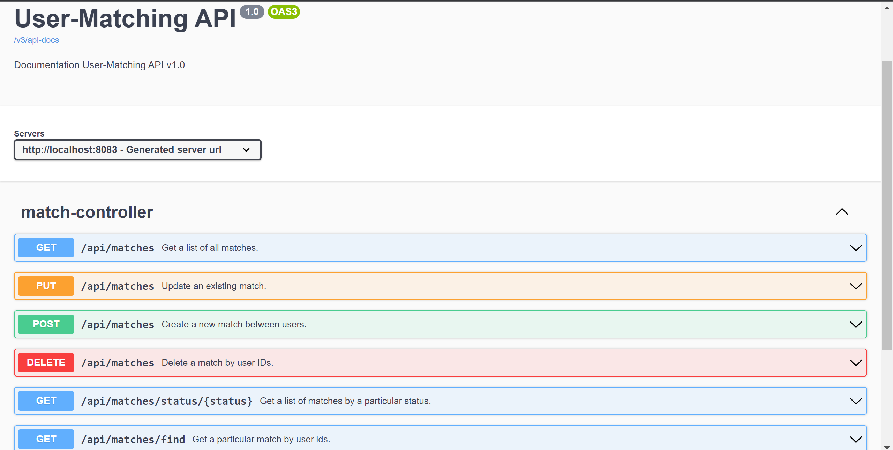
_Screenshot of the user-matching-service API documentation. Provided by Swagger._

Each controller request of every service is annotated with helpful HTTP status information, which is automatically picked up by Swagger and displayed to users in the API documentation. This helps users understand the expected status codes for each request.

For example, the following image shows an example of a Match DELETE request in Swagger:

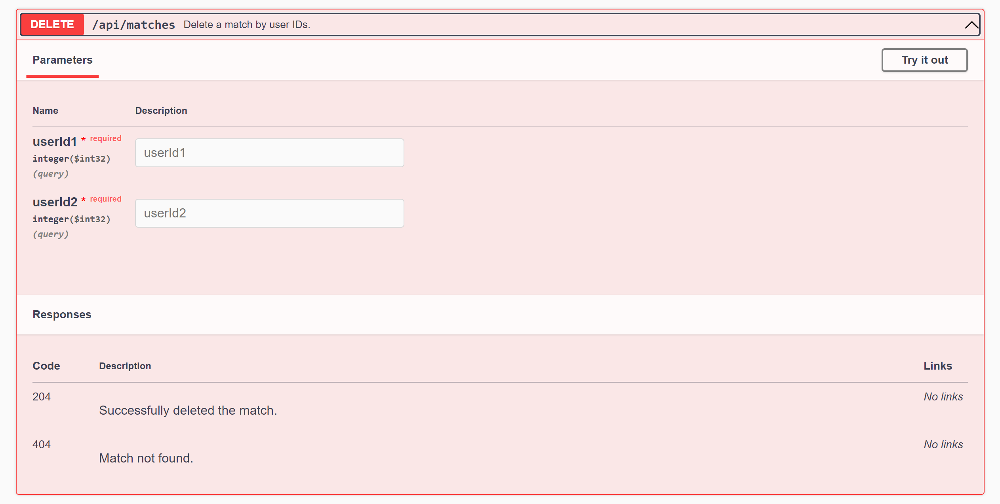
_Example of what a DELETE request looks like in Swagger. Part of the user-matching-service._


## 5. Data persistence
I did a lot of work for data persistence during this semester, as I made a nice start with it during the last semester, I wanted to expand on that knowledge and learn more about it. I did this by trying out different types of databases for the different microservices. The following sections describe everything I did in detail on the subject of data persistence.

### 5.1 SQL and NoSQL databases
In the previous semester, I did a lot of research on the differences and use cases for SQL and NoSQL databases, which helped me a lot in this semester. As a personal challenge, I decided to find a use-case to use both types of databases into my architecture: MongoDB as a NoSQL database and MariaDB as a SQL database.

To better illustrate this, I made an Entity Relationship Diagram:

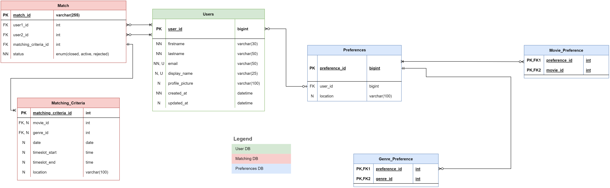
*Current version of the ERD.*

Colours represent different locations/databases (a legend is added for clarity). For example, the microservices for *Preferences* and *Matching* have a NoSQL database because they're likely often going to change and in case more space is needed, NoSQL databases are also easier to scale, considering they scale horizontally. The *User* microservice on the other hand, is more likely to have a steady structure and might require complex queries in the long run, so a relational-database seemed more suitable. 

### 5.2 Testing with different databases
When it comes to testing, there are different approaches you can take. While setting up a containerized database like MariaDB with Testcontainers is an option, not only was I unable to further explore this option due to time constraints, but it is also a less common approach to the problem. I found out that most Java applications use a in-memory database, like H2, to conduct the testing on instead.[^4] It was a bit tricky to get this to work, but eventually after adding "Spring profiles" it did the trick.

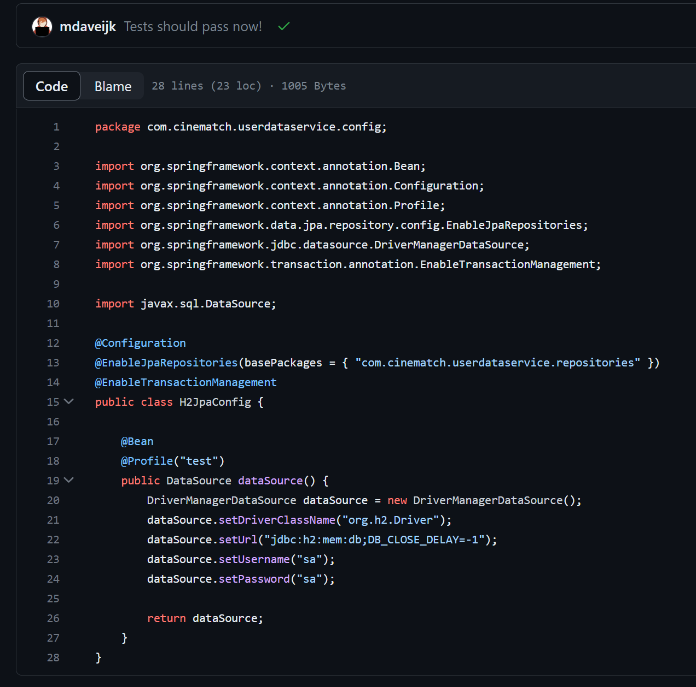
_Configuration class responsible for setting up the test database in the user-data-service._

### 5.3 Hibernate (ORM)
The good news is that even though I am using different types of databases, I can use the same ORM (Object-Relational Mapping) framework for both. Hibernate, being a popular choice for Java applications, provides convenient features for performing CRUD operations and entity mapping.

The underlying framework that uses or "consumes" Hibernate differs depending on the database type. For SQL databases, the commonly used framework is JPA (Java Persistence API). In the case of NoSQL databases, specifically MongoDB, it uses the Spring Data MongoDB framework. For example, the _user-preferences-service_ uses the following code to enable the MongoDB framework:
```
@EnableMongoRepositories
public interface PreferencesRepository extends MongoRepository<UserPreferences, Long> {
    
}
```
``
While the _user-data service_ uses:
```
@RepositoryRestResource
public interface UserRepository extends JpaRepository<User, Long> {

}
```

Both JPA and Spring Data MongoDB each have their own syntax and specific annotations, but they essentially result in the same outcome. We can see Hibernate as a form interface that we interact with by using these annotations; we do not have to worry about the underlying technology. Below is a side by side comparison to showcase the differences between the annotations. You can view the full image by clicking on it.


SQL annotations example             |  NoSQL annotations example
:-------------------------:|:-------------------------:
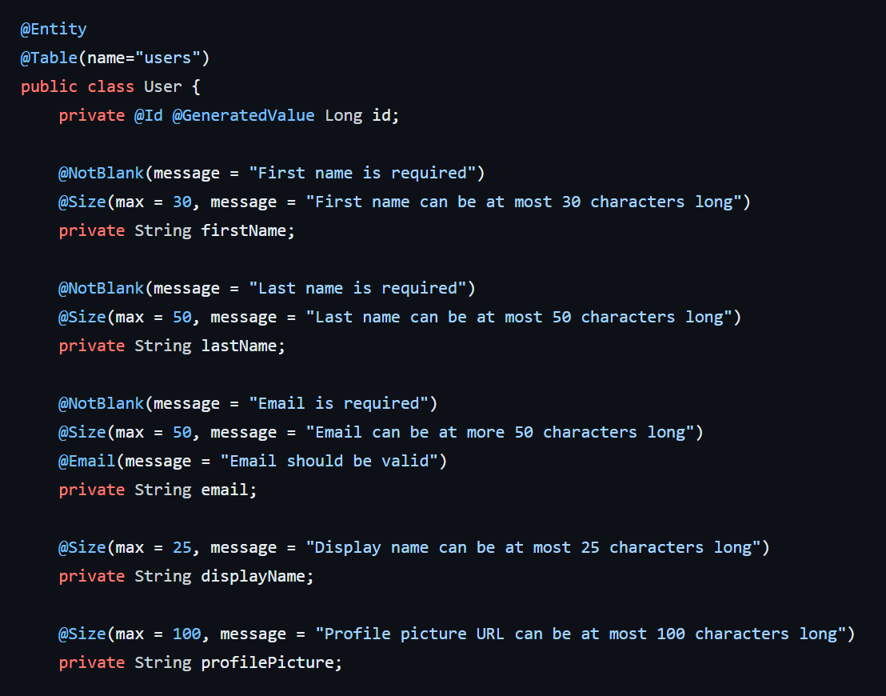  |  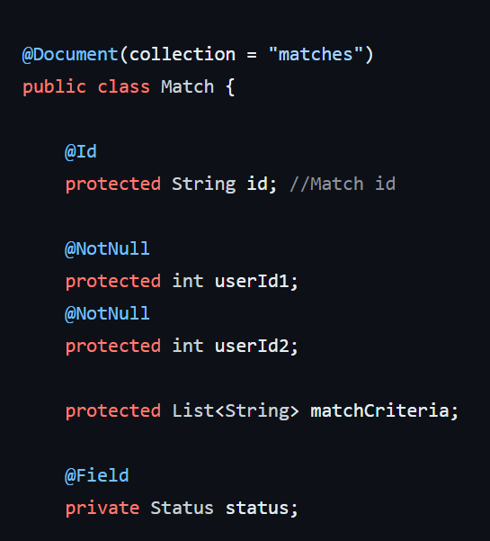

_Different annotations based on the type of database, side by side._

Finally, the interaction with the repositories remains the same, regardless of the database type:

````
```java
    private PreferencesRepository repository;

    public PreferenceService(PreferencesRepository repository) {
        this.repository = repository;
    }

    public Collection<UserPreferences> getAllPreferences() {
        return this.repository.findAll();
    }
```
````
_Code snippet of the PreferencesService for context._

This code snippet is similar for all my services as they are all working with Hibernate; for example, using methods like ``findAll()`` to return a collection.

This makes the process of interacting with the databases so much easier, yet keeps the way data is handled consistent for different database types. By using Hibernate, my application can easily adapt to different database types in the future without major code modifications or changes to the overall architecture.

### 5.4 Movies and cinema data
As mentioned in the **[Backend](#4-backend)** section, my plan was to expand the application by adding additional services to handle movie and cinema-related data. Using a web scraper, the scraped data would be stored in their respective databases. For movies, I would save only a few essential elements that can serve as identifiers for potentially making another request. This approach aimed to achieve a couple of things: 
1. Avoid exhausting the limited requests available for the OMDb API (because I'm using the free version). 
2. Keep the (redundant) calls to a minimum; only having to query for data once if the movie data already exists.
3. Keeping performance: It is much faster to query a local database than to query an external API every time.  
When a user requires more detailed information about a movie, the system can look up if the movie exists and make an API request to retrieve the additional information from the external source and present it to the user. In short: the goal would be to maintain a lightweight database that contains only the necessary information while keeping performance and no exhausting the resource(s).

## 6. User Experience
In terms of user experience, I unfortunately was not able to do as much as I wanted to do. I really wanted to bring what I learned in the previous semester more into practice. Especially since I really like doing design. I spend a lot of time on making the Figma high-fidelity mock-ups look really good, with the thought of allowing people to test the mock-up later instead (like I learned in semester 1) for quick changes to the actual design later. Unfortunately, this approach backfired as it took a big amount of time to complete, leaving me unable to implement the designs as originally planned. Looking back, this might also have been a part of the analysis paralysis that I talk more about in my [**Reflection**](../#42-what-could-have-gone-better).

### 6.1 Heuristics of choice
One of the main challenges was finding a design that uses elements from matching and cinema applications to have familiarity for the users. So, I carefully decided on which UX heuristics[^5] I was planning on using. The research I did on the book "Don't Make Me Think" by Steve Krug once again helped a lot. I started out with the following heuristics in mind:

1. **Consistency and standards** 
This is about user expectations which they have gained through experience with similar products. As both movie and cinema applications are very popular, I aimed to follow their standards and used them for my application.

2. **Recognition rather than recall**
As mentioned in my previous [**Web Application Document**](../GP/LO1_WebApplication/WebApplication_InPractice.pdf): Don't make your users think. This is a principle that I try to use in all of my projects. Familiarity is another way of describing this heuristic. For example, you see this a lot by the usage of the same icons menu items like *Home* 🏠 or *Favourites* ❤️.

3. **Aesthetic and minimalist design** 
Cluttering your designs can keep users from achieving their *objective*. Making it hard to find what you want to do on a website will drain the user's *reservoir of goodwill* and they will eventually leave. To mitigate this outcome, I want to put emphasis on the important aspects of my application. 

These heuristics can serve as guidelines for designing my user interfaces that are user-friendly, intuitive, and visually appealing. After considering these principles, I went on to look for designs that meet these heuristics, aiming for an optimal user experience.

### 6.2 Finding the right design
I conducted a survey among a group of 15 movie enthusiasts, each with their own passion for cinema. To help me with finding a suitable design, I presented them with a selection of designs I found on Dribbble[^6]. All of the designs that I used needed to align with the previously mentioned heuristics while also including visual elements commonly found in matching applications. The results from the survey are shown in the table below:

| Example design 1 | Example design 2 | Example design 3 |
|:-------------------------:|:-------------------------:|:-------------------------:|
| 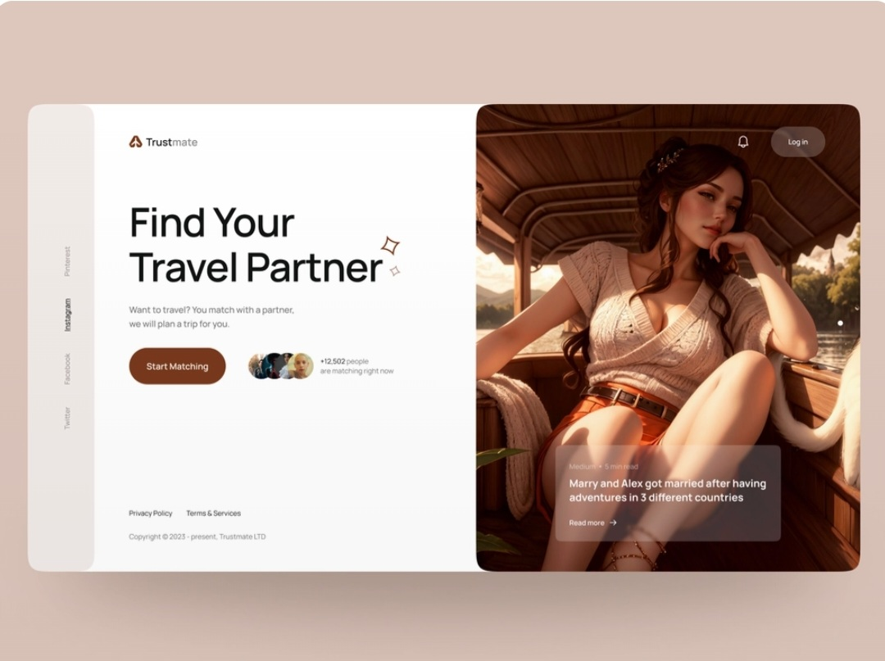 | 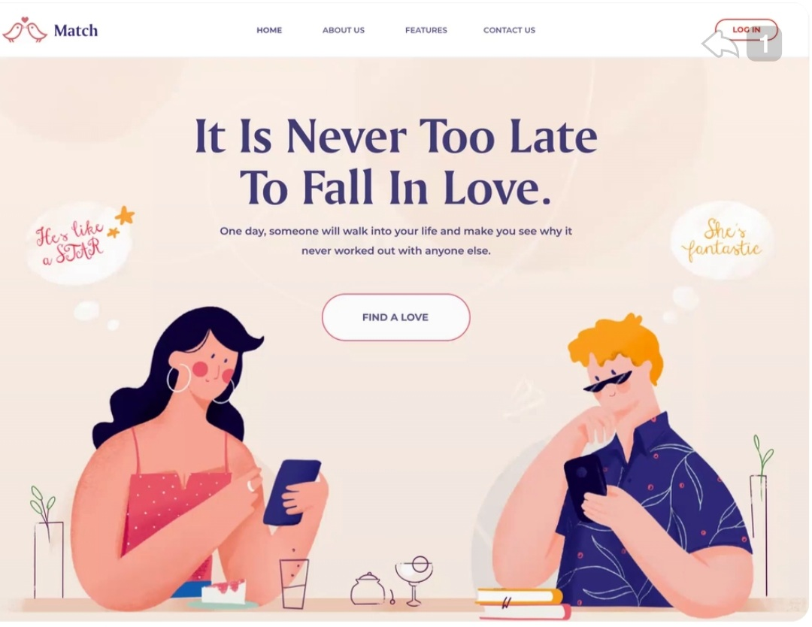 | 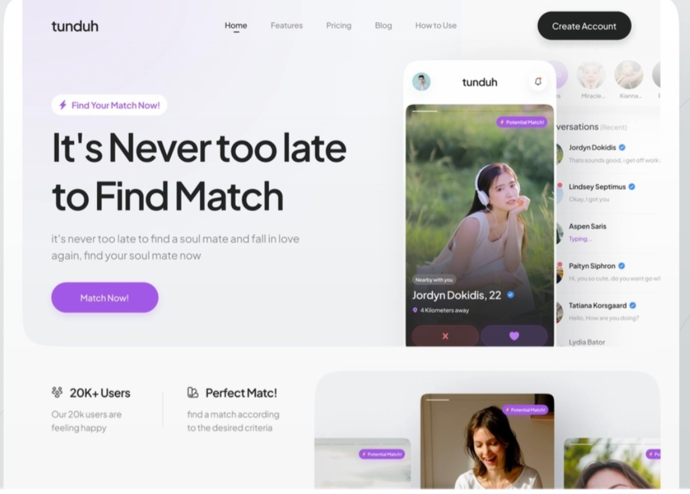 |
| Amount of votes: 7 | Amount of votes: 6 | Amount of votes: 2 |

Based on the feedback and preferences gathered from the survey participants, I created the wireframes shown in the section about [**User Interface Sketches in the Project Analysis document**](../CineMatch/Project_Analysis.md#4-user-interface-sketches).

One particular thing that stood out for the participants that chose the first option is the side-navigator, causing a three-column layout. This feedback has proved very valuable and I made sure to keep it in mind for the next designing phase.

### 6.3 Usability test

Due to some unfortunate events, I was only able to conduct a usability test once, fairly early in the project. Although early usability testing is very important and helped me realize I was heading in the wrong direction mid-semester, it would have been beneficial to conduct another test near the end of the semester to compare results. The test was conducted with one of the people who inspired the CineMatch project.

At some point in the semester, I became confused with the end goal of the user and made an analysis of users creating movie meetups that other users could join, also resulting in user stories and wireframes about that. To illustrate what went wrong, I have included both wireframes to see how the second one changed based on user feedback.

Movie-meetup wireframe (old)             |  Match-making wireframe (new)
:-------------------------:|:-------------------------:
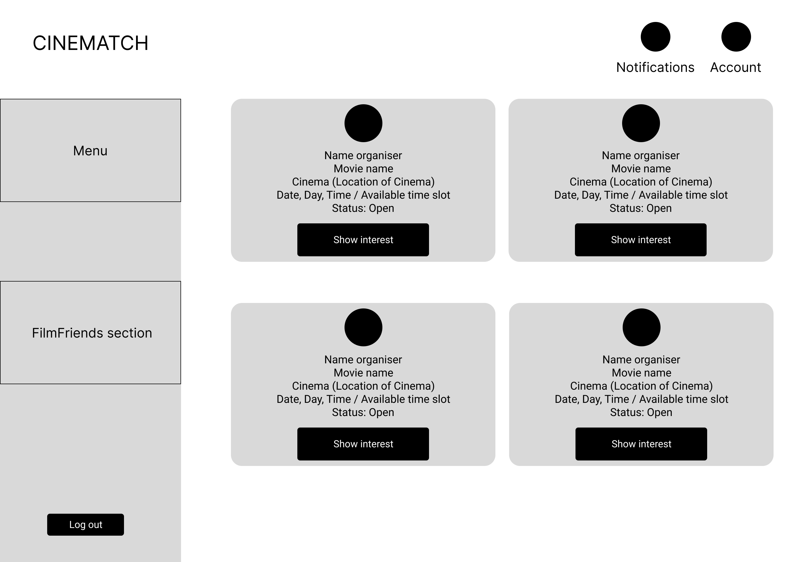  |  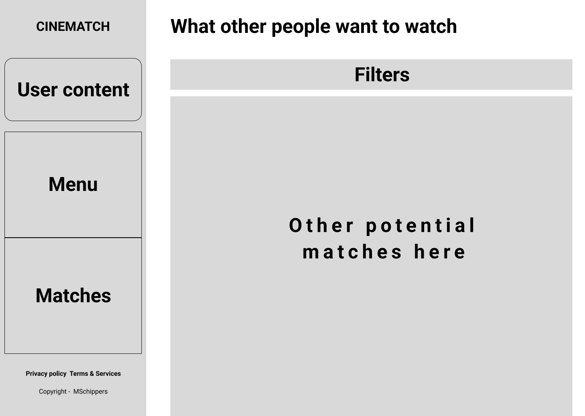

Very confident about what I made, I went in with a paper prototype[^7] of the movie meetup wireframe (made before the survey concluded). However, the participant quickly pointed out that it didn't align with their expectations. On the spot, I made several changes to the potential matches wireframe. Which also drastically changed all the other wireframes that I had made until then as seen in [**User Interface Sketches section of the Project Analysis document**](../CineMatch/Project_Analysis.md#4-user-interface-sketches). 

In addition, to make the most out of the test, I took the opportunity to showcase another design which I found, taking some of the key elements into account. The participant liked it a lot. The table below shows how I went from a design, I made a wireframe and eventually turned it into a high-fidelity mock-up for my own application. The attempt at making this a real interface is presented in the [**Frontend section**](#2-frontend). 

| Design found online | Wireframe | High-fidelity mock-up |
|:-------------------------:|:-------------------------:|:-------------------------:|
| 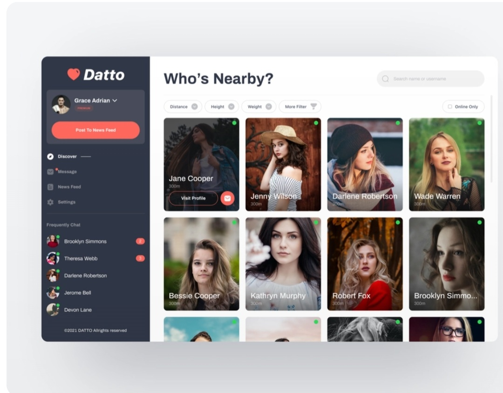 |  | 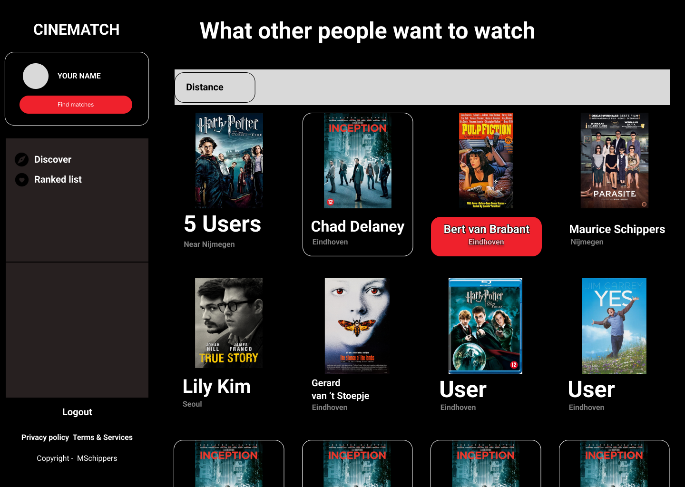 |


Moving forward, I learned that early feedback is very valuable. I'm certain that by using the [**Splitting by interface**](../README.md#311-additional-experience) agile technique, it will be easier to present interactive UI sooner to the client in future projects.

[^1]: See [Building Full-Stack Apps with React and Spring](https://www.linkedin.com/learning/building-full-stack-apps-with-react-and-spring?u=2095956)
[^2]: See [OMDb API - The Open Movie Database](https://www.omdbapi.com/)
[^3]: See [Spring Boot Microservices Level 1: Communication and Discovery by Java Brains](https://www.youtube.com/playlist?list=PLqq-6Pq4lTTZSKAFG6aCDVDP86Qx4lNas)
[^4]: See [Self-Contained Testing Using an In-Memory Database](https://www.baeldung.com/spring-jpa-test-in-memory-database)
[^5]: See [10 Usability Heuristics for User Interface Design](https://www.nngroup.com/articles/ten-usability-heuristics/)
[^6]: See [Dribbble](https://dribbble.com/)
[^7]: See [Paper prototyping on YouTube](https://youtu.be/V8LNDqMIapY)
