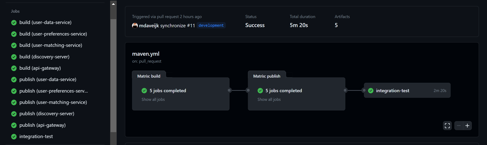

# Reader's Guide

Author: Maurice Schippers    
Class: Software - S3-DB01 – Eindhoven  
Course: S-DB-IPS  & S-DB-GPS   
Coach: Jean-Paul Ligthart & Marc van Grootel   
Date published: 15 June 2023  
Version: 3.0

<!-- TODO update table of contents -->

## Table of Contents
- [1. Introduction](#1-introduction)
- [2. IPS - CineMatch](#2-ips-cinematch)
	- [2.1 Web Application (LO1)](#21-web-application-lo1)
		- [2.1.1 This semester](#211-this-semester)
		- [2.1.2 Last semester](#212-last-semester)
	- [2.2 Software quality (LO2)](#22-software-quality-lo2)
	- [2.3 CI/CD (LO4)](#23-cicd-lo4)
	- [2.4 Requirements and design (LO6)](#24-requirements-and-design-lo6)
		- [2.4.1 This semester](#241-this-semester)
		- [2.4.2 Last semester](#242-last-semester)
	- [2.5 Professional (LO8)](#25-professional-lo8)
	- [2.6 Security research on authentication/authorization](#26-security-research-on-authenticationauthorization)
	- [2.7 Research on concurrency](#27-research-on-concurrency)
- [3. GPS](#3-gps)
	- [3.1 Agile method (LO3)](#31-agile-method-lo3)
		- [3.1.1 Additional experience](#311-additional-experience)
	- [3.2 Cultural differences and ethics (LO5)](#32-cultural-differences-and-ethics-lo5)
	- [3.3 Business processes (LO7)](#33-business-processes-lo7)
- [4. Reflection](#4-reflection)
	- [4.1 What went well](#41-what-went-well)
	- [4.2 What could have gone better](#42-what-could-have-gone-better)
	- [4.3 Next steps](#43-next-steps)

# **1. Introduction**

Welcome to my portfolio for S3-DB01 (Spring, 2023). 
This document serves as the reader's guide to my portfolio items of
S3-DB01 (Spring, 2023). For the reader's guide of the previous S3 semester (Fall, 2022) where I mainly focussed on the GPS, please click **[here](GP/ReadersGuidePortfolio_MauriceSchippers_v2_0.pdf)**.

This portfolio is organized into two main sections: The IPS and the GPS section. 
The first section is the IPS section, which contains all of the work I have completed during **this** semester. Each subsection includes links to the created work, a description or an explanation of how it relates to the learning outcomes (LOs), and notes on any overlapping information regarding LOs. Additionally, if relevant, a link to work from the previous semester is provided.
The second section is the GPS section, which contains all the LOs related to the GPS and the links to the work I did for them in the previous semester. For LO3 (Agile method), I did some additional work during this semester which is also added there.

The final section includes my overall reflection on the semester. This section is divided into subsections, where I look back upon what went well, what could have gone better and decide on what my next steps will be.

Please note that bold and underlined text indicates a clickable link. 

**[⬆️ Back to Table of Contents](#table-of-contents)**

# 2. IPS - CineMatch

In this section, I will discuss how I applied the IPS learning outcomes to the development of CineMatch. Upon taking a closer look, I realized that each outcome represents a part of the software development cycle, with **[Professional](#25-professional-lo8)** being a continuous process as developers are always busy with research and improving their skills and knowledge.

During the **[analysis phase](#24-requirements-and-design-lo6)**, I focused on gathering requirements and designing the most suitable architecture for the project. In the **[building phase](#21-web-application-lo1)**, I used React, SpringBoot, and Hibernate as my tech stack of choice to develop the web application. For the **[testing phase](#22-software-quality-lo2)**, I setup a quality plan which contains various testing techniques. Finally, in the **[release phase](#23-cicd-lo4)**, I setup a CI-pipeline that builds and publishes Docker images to DockerHub, enabling continuous integration and delivery to complete the software development cycle and release of CineMatch.

## 2.1 Web Application (LO1)

This learning outcome covers the five key elements of developing a web application: **frontend, distributed communication, backend, data persistence, and user experience**. In both the current and last semester, I wrote a large document detailing how I applied these five elements to my projects, including the group project of last semester. 

Furthermore, to make a well informed decision, I conducted a thorough comparison of the three most popular frontend frameworks during the last semester. The details of this research can be found in the following section **[2.1.2 Last Semester](#212-last-semester)**. 

### 2.1.1 This semester

The reasoning behind my choices can also be found in the document. 

📄 **[Full Stack Web Application - CineMatch](CineMatch/WebApplication_InPractice.md)**   
Quick access to the five sections in the document: 
- [**Frontend**](CineMatch/WebApplication_InPractice.md#2-frontend) 🌐
- [**Distributed Communication**](CineMatch/WebApplication_InPractice.md#3-distributed-communication) 📡
- [**Backend**](CineMatch/WebApplication_InPractice.md#4-backend)⚙️
- [**Data Persistence**](CineMatch/WebApplication_InPractice.md#5-data-persistence) 🗄️
- [**User Experience**](CineMatch/WebApplication_InPractice.md#6-user-experience) 🎨  

The links to the repositories for the frontend and backend source code of CineMatch:   
🌐 **[CineMatch frontend](https://github.com/mdaveijk/S3-IP-CineMatch-Frontend)** | ⚙️ **[CineMatch backend](https://github.com/mdaveijk/S3-IP-CineMatch)**

### 2.1.2 Last semester

I'm very satisfied with how the document from the last semester came out. It mainly covers my work in the group project. As a source of inspiration for the user experience part, I read the book 'Don't Make Me Think' by Steve Krug. This book was very helpful and inspired me a lot.

At the beginning of that semester, I had little to no knowledge of JavaScript, which played a crucial role in my choice of frontend framework. So, I planned to develop this application with Vue.js for the frontend and C# for the backend. My research regarding the frameworks can be found under the following sections:
↳ 2. IPS - VoiceCheck 
	↳ 2.1 Frontend 
		↳ 2.1.1 Framework research

I was given the **Proficient** rating.

📄 **[Web Application in Practice](GP/LO1_WebApplication/WebApplication_InPractice.pdf)**

**[⬆️ Back to Table of Contents](#table-of-contents)**
## 2.2 Software quality (LO2)

The quality plan is a central document where all tests are documented to keep things readable.

### 2.2.1 Quality plan
This document contains all the testing I have done for CineMatch. Including the ones discussed in the researches.

### 2.2.2 Research on identification and authentication failures

I conducted an extensive research on the OWASP issue of identification and authentication failures. The research report covers the following subjects:

- a description of the subject through a real-life example;
- techniques and strategies for finding and preventing identification and authentication failures;
- a possible solution to mitigate these failures;
- testing the implemented solution to evaluate its effectiveness.

Based on the result of this research, I implemented Keycloak as a Single Sign-On service in CineMatch. This addition serves as an extra layer of security, further boosting the overall security of the application.

Read more about it here: [**Security Research**](Research/Security_Research_Identification_and_Authentication_Failures.md) 🕵🏻

### 2.2.3 Research on concurrency

Read more about it here: [**Concurrency Research**](Research/Concurrency_Research.md) 🕛
<!-- TODO -->

**[⬆️ Back to Table of Contents](#table-of-contents)**
## 2.3 CI/CD (LO4)

I set up a CI pipeline using GitHub Actions for both the frontend and the backend. Each pipeline consists of two stages: "Build" and "Publish", but the backend includes an additional "Integration test" stage. Both workflows slightly differ in design but the outcome for the stages "Build" & "Publish" are similar to each other.

These CI/CD pipelines enable the automated building, testing, and continuous deployment of both the frontend and the backend services.

### 2.3.1 Frontend

For the frontend React application, a separate CI/CD pipeline was set up using GitHub Actions. This pipeline also consists of two stages: "Build" and "Publish".

In the "Build" stage, the code is checked out, Node.js version 16 is set up, and Node dependencies are installed. The source code is then built using npm and tested.

In the "Publish" stage, the repository is checked out, Docker buildx is set up, and Docker login is performed for the specified Docker registry (excluding pull requests). Docker image metadata is extracted, and the Docker image is built and pushed to DockerHub.

### 2.3.2 Backend

In the backend "Build" stage, the code is checked out, JDK 17 is set up, and Maven dependencies are cached. The application is then built and analyzed using Maven. Unit tests are executed, and SonarCloud is used to scan for code smells, bugs, and vulnerabilities. The build artifacts are also uploaded as artifacts. This step is needed in order for the next stage to work.

In the "Publish" stage, the repository is checked out, and the previously built artifacts are downloaded. Docker login is performed for the specified Docker registry. Docker image metadata is extracted, and the Docker image is built and pushed to DockerHub.

Finally, the "Integration test" stage uses tests which are written in Postman to test the API endpoints. At the time of writing, these tests are only written for the user-matching-service. Hoping to serve as a practical proof of concept that I know how it works.

Although I successfully configured Keycloak for authentication and authorization in my application, integrating it into the CI-pipeline proved very difficult and time-consuming. I found out that it is possible to test Keycloak in the CI-pipeline using Testcontainers, but I did not have the opportunity to try and implement it due to time constraints.

*Screenshot of the workflow file for the backend services with a successful run.*

Checkout the workflow files here:

🌐🔄 **[Workflow frontend](https://github.com/mdaveijk/S3-IP-CineMatch-Frontend/blob/main/.github/workflows/main.yml)** | ⚙️🔄 **[Workflow backend](https://github.com/mdaveijk/S3-IP-CineMatch/blob/main/.github/workflows/maven.yml)**

**[⬆️ Back to Table of Contents](#table-of-contents)**
## 2.4 Requirements and design (LO6)

Requirements analysis and design are crucial components of the software development process, as they ensure that a software system meets the needs and expectations of its users. In this section, you will find documentation on how I applied these principles to my individual projects, CineMatch (current semester) and VoiceCheck (last semester), as well as to the group project of the last semester. I wrote a pitch and an analysis document for each of my individual projects, which helped me to identify and prioritize requirements and design a solution that met those requirements, while keeping my users (stakeholders) in mind. 

The goal of this section is to demonstrate my proficiency in analysing requirements and software design.

### 2.4.1 This semester

For CineMatch, I started with a pitch and created an extensive project analysis, which includes a description of the project, three levels of the C4-model-based system architecture overview, user stories with acceptance criteria, and UI sketches. The idea came together because of increasing demand for a buddy to go to the cinema with. 

In addition, I have created a story map for the entire project in Jira. You can view the full image by clicking on it.

📄🗣️ **[CineMatch Pitch](CineMatch/CineMatch_Pitch.md)** |
📄🔎 **[CineMatch Project Analysis](CineMatch/Project_Analysis.md)**

**[⬆️ Back to Table of Contents](#table-of-contents)**
### 2.4.2 Last semester

Before it was decided that I would only focus on GPS, I came up with the idea for "VoiceCheck" as my individual project, which I also wrote a pitch and an analysis document for. 

Accompanied by my work in the GPS project where I worked on - among other things - the entity relationship diagram, I was given the **Proficient** rating.

📄🗣️ **[VoiceCheck Pitch](GP/LO6_Requirements_and_design/VoiceCheck_Pitch.md)** | 
📄🔎 **[VoiceCheck Project Analysis](GP/LO6_Requirements_and_design/IP_VoiceCheck_Analysis.pdf)** | 
📄🔎 **[GP Project Analysis](GP/LO6_Requirements_and_design/GP_Project_Analysis.pdf)**

**[⬆️ Back to Table of Contents](#table-of-contents)**

# 3. GPS

The following sections contain all the work I did in the previous semester for the (mainly) GPS learning outcomes.

## 3.1 Agile method (LO3)

During this semester, I attended a webinar hosted by Mike Cohn on writing better user stories. More information about this experience can be found in the **[Additional Experience](#311-additional-experience)** section. I am using the Scrum approach for my current individual project.

In the previous semester, I wrote two documents: a research paper on agile methodologies and a paper on how I applied it in the group project. I was given the **Advanced** rating. 

📄 **[Agile research](GP/LO3_AgileMethod/AgileMethods_Research.pdf)**
📄 **[Agile in Practice](GP/LO3_AgileMethod/AgileMethods_InPractice.pdf)**

### 3.1.1 Additional Experience
<!-- TODO small review on webinar -->

**[⬆️ Back to Table of Contents](#table-of-contents)**
## 3.2 Cultural differences and ethics (LO5)

During the previous semester, I wrote an elaborate paper covering both ethics and cultural differences in IT. In particular, I discuss "The ACM Code of Ethics and Professional Conduct" and how they are applied with real-life examples.  The second part of the paper focused on cultural differences, including how Fontys strives to support its students in this regard, the distinction between cultural and personal traits, and my own experiences of collaborating with students from different cultures. I was given the **Advanced** rating. 

📄 **[Ethics and cultural differences](GP/LO5_Cultural_differences_and_ethics/Cultural_Differences_and_ethics_Report.pdf)**

**[⬆️ Back to Table of Contents](#table-of-contents)**
## 3.3 Business processes (LO7)

During the previous semester, I conducted a process analysis of the group project context. I communicated with the stakeholder(s) regarding possible changes and to confirm the accuracy of the information. I was given the **Proficient** rating. 

📄 **[Process analysis of the group project](GP/LO7_BusinessProcesses/GP_ProcessAnalysis.pdf)**

**[⬆️ Back to Table of Contents](#table-of-contents)**
# 4. Reflection

This section looks back on the entire semester and I talk about what I have learned from things that went well, didn't work out so well and what my next steps will be.

## 4.1 What went well

<!-- I learned a lot of new things. Worked with several new technologies and programs.  -->

This semester I aimed to be a generalist. And I feel like I succeeded at doing so. I wanted to expand my boundaries and try a lot of new things: (Java, React, MongoDB, Keycloak, Figma, Microservices, to name a few). I also spend less time on a problem than usual, which is a huge improvement for me because in the past I would not move on to other things unless the problem at hand was fixed.

## 4.2 What could have gone better

<!-- TODO Analysis Paralysis -->
I have the tendency to get overwhelmed easily (as stated in the previous reflection). I tried to find ways to mitigate this later on in the semester. Playing it safe instead of envisioning some big project; as creativity can be both a blessing and a curse. But how do you know you're stuck in a loop when you think you're taking the right path? This semester taught me that I'm sometimes scared of bringing the new things I learned into practice, which brings me back to the cycle of analysis paralysis, a term often heard in the world of software development. 

## 4.3 Next steps

The section about "Before the Project" in the book The Pragmatic Programmer helped me find a way to deal with a lot of the problems I struggled with. I learned that delivering something that doesn't suffice is always better than not to deliver something.

**[⬆️ Back to Table of Contents](#table-of-contents)**

