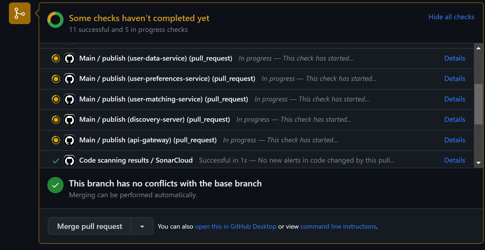
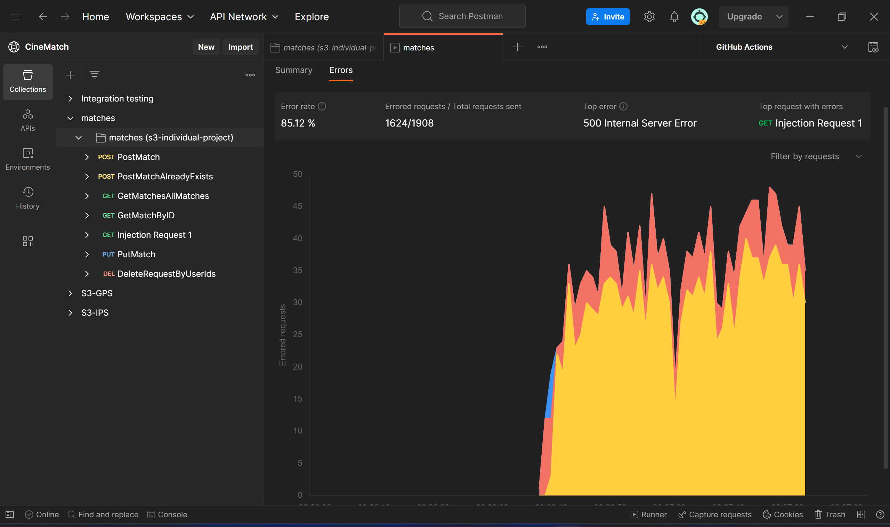
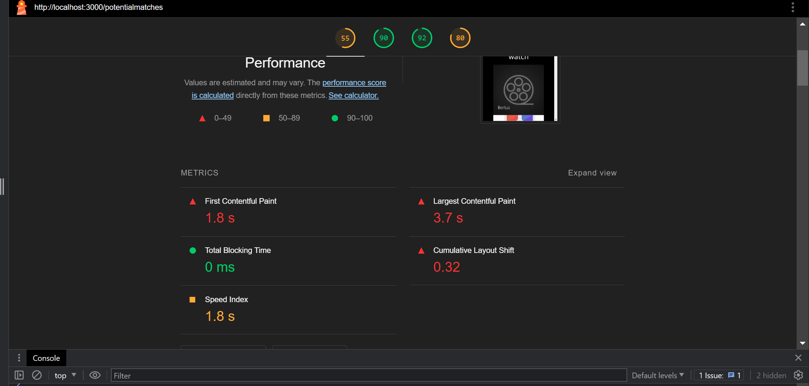

# How can concurrency be effectively implemented in a distributed software web application to improve performance and scalability?


## Table of contents
- [1. Introduction](#1-introduction)
- [2. What is concurrency?](#2-what-is-concurrency)
	- [2.1 Examples of concurrency](#21-examples-of-concurrency)
	- [2.2 Examples of parallelism](#22-examples-of-parallelism)
- [3. What are the challenges of using concurrency and parallelism in web development?](#3-what-are-the-challenges-of-using-concurrency-and-parallelism-in-web-development)
	- [3.1 Increased complexity and difficulty](#31-increased-complexity-and-difficulty)
	- [3.2 Bugs and errors](#32-bugs-and-errors)
	- [3.3 Resource-intensive](#33-resource-intensive)
	- [3.4 Synchronization and coordination](#34-synchronization-and-coordination)
- [4. Which design patterns are available for concurrency?](#4-which-design-patterns-are-available-for-concurrency)
	- [4.1 Actors and Processes](#41-actors-and-processes)
	- [4.2 Blackboard](#42-blackboard)
	- [4.3 Microservices](#43-microservices)
- [5. Where can I find places to improve concurrency within my application?](#5-where-can-i-find-places-to-improve-concurrency-within-my-application)
	- [5.1 Manually](#51-manually)
		- [5.1.1 Mutex and semaphores](#511-mutex-and-semaphores)
		- [5.1.2 Activity diagrams](#512-activity-diagrams)
	- [5.2 Automated](#52-automated)
	- [5.3 Tips for Before You Start Coding](#53-tips-for-before-you-start-coding)
- [6. Conclusion](#6-conclusion)
- [7. References](#7-references)

## 1. Introduction

I became interested in the topic of concurrency after reading chapters about concurrency in the books Clean Code and The Pragmatic Programmer. Both of these books will be used as professional sources of literature for this research. As concurrency has always been a challenging subject for me to implement effectively, I decided to dedicate this research to gaining a better understanding of it. Please note that this research takes a general approach to the topic; aiming to find solutions applicable to multiple languages or technologies in the context of a distributed web application. As this topic is exceptionally broad, it is important to keep the scope feasible. 

Concurrency is widely recognized as a complex and challenging aspect of software development, even among experts in the field. They agree that there is no 'perfect' way to handle concurrency, but there are best practices that we can follow. We also often hear that concurrency does not always *guarantee* performance improvement. If not used with the appropriate resources or implemented correctly, concurrency can instead create complexity and potentially hinder performance. So, this begs the question: **How can concurrency be effectively implemented in a distributed software web application to improve performance and scalability?**

In order to help me and find an answer to the main question, I will be using these DOT-framework methods:
- Literature study (Library)
- Design pattern research (Library)
- Non-functional test (Lab)
- Static program analysis (Showroom)

## 2. What is concurrency?

Let's start with the basics. To understand concurrency, we have to understand parallelism. This quote explains it in the most clear way:

> "_Concurrency_ is when the execution of two or more pieces of code act as if they run at the same time. _Parallelism_ is when they _do_ run at the same time. 
> To have concurrency, you need to run code in an environment that can switch execution between different parts of your code when it is running. This is often implemented using things such as fibers, threads, and processes.
> To have parallelism, you need hardware that can do two things at once. This might be multiple cores in a CPU, multiple CPUs in a computer, or multiple computers connected together."

(Thomas & Hunt, 2019, p. 169)

Concurrency is a decoupling strategy that allows tasks to be executed independently without blocking the execution flow. One way of doing that is using the programming concepts `async` and `await`. Here are some examples to illustrate concurrency and parallelism in web development.

### 2.1 Examples of concurrency

Let's explore an example of concurrency in the context of distributed web applications, focusing on the use of `async` and `await` in combination with an API interaction. Here is a React code snippet that fetches users from a database asynchronously:
```javascript
export function getUsers() {
  const [users, setUsers] = useState([]);

  useEffect(() => {
    async function getUsers() {
      try {
        const { data } = await axios.get("http://localhost:8080/api/users");
        setUsers(data);
        console.log("test", data);
      } catch (error) {
        console.log("Something went wrong:", error);
      }
    }

    getUsers();
  }, []);

  return users;
}
```
*Code snippet from the CineMatch frontend to fetch users.*

In this code snippet, we define a function called `getUsers()`, which uses the React `useEffect()` hook to fetch users asynchronously. The `await` keyword is used to pause the execution of the function until the HTTP request to the API is complete, allowing for concurrent processing of the data.

Concurrency can be found in various scenarios, such as:

- Distributed web applications with a microservices architecture, where independent services handle requests and process data concurrently.
- Multi-threaded programs, where multiple threads execute tasks concurrently, enabling parallel execution and efficient utilization of system resources.
- **Web workers**: Web workers are JavaScript scripts that run in the background, separate from the main browser thread. They enable concurrent execution of intensive tasks without blocking the user interface, improving the responsiveness of web applications. You basically do not even notice their presence. 
- **Message queues**: Message queues, such as RabbitMQ or Apache Kafka, allow for asynchronous processing and communication between different components or services in a distributed system. Messages can be 'consumed' and processed concurrently, enabling efficient and scalable data processing.

### 2.2 Examples of parallelism

Parallelism is closely related to concurrency and refers to the simultaneous execution of multiple tasks in parallel, but use multiple hardware resources instead. Some common examples of parallelism include:

- **GitHub workflow files:** In a workflow file, executing jobs in parallel, where each job is processed concurrently and progresses to the next stage only when all jobs are completed. In the screenshot below, we can see the publish jobs all running on the same time. This is because it makes use of multiple resources within GitHub.  
- **Microservices:** Using a microservices architecture, which can contribute to creating a parallel infrastructure. More details about this will be discussed in the [**design patterns section on microservices**](#43-microservices).
- **Docker:** If you have used Docker, you have already experienced parallelism, as Docker containers can run concurrently on different cores of your system.


## 3. What are the challenges of using concurrency and parallelism in web development?

As mentioned in the [**Introduction**](#1-introduction), while concurrency (and parallelism) can greatly improve web development, they also introduce certain challenges. The Technical Design article discusses a good portion of the obstacles in concurrent programming, here's a summary of the key takeaways (Technical Design, n.d.):

### 3.1 Increased complexity and difficulty

One thing to keep in mind when using concurrency and parallelism is that they can make our code more complex and harder to understand. When we have multiple tasks happening at the same time, it can be challenging to keep track of all the variables, states, and interactions.

### 3.2 Bugs and errors

Concurrency and parallelism introduce new opportunities for bugs and errors to occur. With multiple tasks running concurrently, there can be conflicts, deadlocks, race conditions, and data inconsistencies when these tasks try to access and modify the same resources simultaneously. It is recommended to study these concepts before going any deeper into the topic.

### 3.3 Resource-intensive

It's important to note that especially parallelism can be resource-intensive. To achieve parallel execution, we might need additional CPU cores or processing power. However, not all systems or environments have abundant resources available. As mentioned in the section about [Microservices](#43-microservices), it can have significant drawbacks and potentially be harmful to the hardware instead.

### 3.4 Synchronization and coordination

When multiple tasks run concurrently, proper synchronization and coordination is very important. Letting tasks access shared resources in a controlled manner if there is no other way around it, avoiding conflicts and maintaining data consistency, requires careful synchronization techniques.

In summary, it takes a lot of effort to configure and maintain this in a feasible way. This is why more and more languages have been producing libraries to help developers write concurrent programs, more about that in the section about [**Tips for Before You Start Coding**](#53-tips-for-before-you-start-coding). Design patterns are also very helpful, this is what we will explore in the next section.

## 4. Which design patterns are available for concurrency?

Now, let's explore different design patterns that can help us effectively manage and implement concurrency. It is recommended to keep a close eye on concurrency opportunities early in the architecture design phase, more about that in the next section. 
There are several design patterns specifically designed to handle concurrency. Here are some commonly used ones:

### 4.1 Actors and Processes

In programming, an actor or process is like a small independent unit that performs a specific task. Think of it as a separate worker that can handle its own work without depending too much on other workers. These actors or processes each have a 'mailbox' which allow them to communicate and interact with each other by exchanging messages. This approach helps manage concurrency because each actor or process can work on its tasks independently, without interfering with others. It's like having multiple workers in a team, where each worker focuses on their specific job without needing to wait for others. 
(Thomas & Hunt, 2019, sec. Actors and Processes)

### 4.2 Blackboard

Imagine you have a big board where everyone in a team can read and write information. In programming, the blackboard pattern is similar to this concept. It involves creating a shared repository or knowledge base where different components or agents can contribute information asynchronously. This pattern is useful when you have multiple entities or parts of a system that need to work together on a problem. Each entity can read from and write to the blackboard, allowing them to share information and collaborate on finding a solution. It's like having a whiteboard where team members can write down their ideas and insights for everyone else to see. (Thomas & Hunt, 2019, sec. Blackboards)

### 4.3 Microservices

As I mentioned earlier, microservices architecture is an approach where an application is divided into small, independent services. These services are loosely coupled, meaning they can be developed, deployed, and scaled independently. This approach promotes both concurrency and parallelism as they are separate units, leading to improved performance and scalability.

However, it's important to note that running multiple microservices simultaneously can be resource-intensive. It requires hardware capable of handling the load of multiple applications running at the same time. In my experience, I found that running multiple microservices on my laptop was challenging. It struggled to handle the demands, resulting in increased heat and reduced performance.

For example, when using Docker-Compose with various services like the API gateway, discovery server, core microservices, and different databases, the resource requirements can be significant. In a healthy environment with sufficient hardware resources, this setup should work smoothly. But on a laptop or limited hardware, it may pose difficulties.

It's important to consider the hardware limitations and ensure they align with the requirements of running multiple microservices. If the hardware cannot handle the load, it may be necessary to scale down the number of services or consider alternative architectures.

While implementing a design pattern is a good start, there are more elements that require attention in order to achieve concurrency. In the next section, we will look at possible ways to identify these opportunities.  

## 5. Where can I find places to improve concurrency within my application?

In this section, I will discuss some ways to find potential opportunities to improve concurrency in web applications. I added an extra section for tips to keep in mind during the design process.

### 5.1 Manually

When looking for places to improve concurrency in your application, focus on finding places where data is shared or a common resource pool. It's important to keep the usage of shared data to a minimum. Shared data can introduce complexities and challenges in managing concurrent access, leading to potential issues and bugs. 

An example of shared data and potential concurrency issues is when you have multiple operations happening at the same time, like updating and deleting data. Imagine you have a PUT request to update some information and a DELETE request to remove the same data. If these operations occur simultaneously without proper handling, problems can arise. For instance, one operation might accidentally overwrite the changes made by the other operation, causing data inconsistencies or incorrect results. It's really important to be careful when dealing with shared data like this and use the right techniques to manage concurrency. By doing so, you can ensure that your data stays intact and accurate, even when multiple operations are happening at once.

#### 5.1.1 Mutex and semaphores 

One way to solve this problem is by using a 'lock' to make sure that only one operation can change the data at a time. With a lock, when one operation takes control of the data, the other operation has to wait until the lock is released. This way, we can make sure that the operations are done in order and avoid any conflicts or mistakes.

To do this, we can use special tools called 'mutexes' or 'semaphores' that are available in our programming language:

- **Mutex**: A mutex is like a special key that only one operation can hold at a time. When an operation wants to modify shared data, it needs to get the mutex key first. If another operation already has the key, it has to wait until the key is released before it can proceed. This way, the mutex ensures that only one operation can access the shared data at any given time.

- **Semaphore**: A semaphore is like a counter that keeps track of how many operations can access a shared resource simultaneously. It's like having a limited number of seats in a movie theatre. Each operation that wants to use the shared resource takes one seat. If all the seats are taken, new operations have to wait until a seat becomes available. Semaphores help control the number of concurrent operations that can access the shared resource.

We create a lock around the shared data using one of these tools. Before an operation makes any changes, it needs to get the lock. Once it finishes its work, it releases the lock for other operations to use. This ensures that only one operation can work with the data at a time, keeping everything safe and organized.

By properly using locks and synchronizing the concurrent operations on shared data, we can prevent any problems like race conditions and make sure that our results are accurate and dependable. Just remember to learn about the specific tools and techniques provided by your programming language or framework and follow the recommended practices for handling concurrency effectively. (Baeldung, n.d.)

#### 5.1.2 Activity diagrams
Another way to explore possible opportunities for concurrency within your code is by making activity diagrams. You can look for activities that take time to complete in real time, not in code, and see if there are any other computations that could be done during that execution time asynchronously. 

### 5.2 Automated
Sometimes it is hard to find those places where the application would be able to benefit from concurrency. That is where automated (test) tools come in. There are some different types of tools that we can use and help find different aspects to improve. Here are some of the tools I used to test on CineMatch, my distributed web application:

- **SonarCloud:** SonarCloud is a code quality analysis tool that can help you identify code smells, bugs, and vulnerabilities in your application. It can also provide insights into potential concurrency issues. By analysing your codebase with SonarCloud, you can detect areas where concurrency-related problems may exist, such as bad synchronization or inconsistent access to shared resources. What's more, you can integrate SonarCloud into your CI-pipeline, to scan every time a certain event is triggered. This can help even more with detecting problems early in the project and is one of the recommended things to do, as is mentioned in [**Tips for Before You Start Coding**](#43-tips-for-before-you-start-coding). SonarCloud's feedback and very helpful recommendations can also guide you in making improvements to enhance concurrency in your application. 

- **Load Testing with Postman:** By performing load testing using tools like Postman, you can simulate high user loads and measure the application's performance under heavy concurrency. This can help you uncover potential bottlenecks and areas where concurrency improvements can be made. For example, when load testing one of my APIs, it mostly returned a 500 response, which when digging deeper came from the fact all 'virtual users' tried to POST a new Match object at the same time, so the application responded with an error because the id of the newly created entity was no longer unique. This could potentially be solved by using the [**Mutex and semaphores**](#511-mutex-and-semaphores) approach. Below is a screenshot of these errors while conducting the load test with Postman. 

- **Performance Testing with Google Lighthouse:** Google Lighthouse is a tool that can analyse the performance of your web application. It provides insights into various metrics such as response times, resource usage, and overall performance. By examining the results, you can identify areas where concurrent execution can be applied to enhance performance and responsiveness. In particular, one very important aspect of achieving concurrency, is not having any 'blocking' calls in your application. For example, when building Java applications with MongoDB, you are able to choose between dependencies that either support blocking or non-blocking calls. According to the results from the Google Lighthouse test, CineMatch has a total blocking time of 0ms which is really good for concurrency.  

Blocking and non-blocking calls are related to the order of execution: synchronized or asynchronously. Blocking will wait before something is finished, asynchronously does not care about the state. (PITKAMAKI, n.d.)


### 5.3 Tips for Before You Start Coding

When working with concurrency, there are some important things to keep in mind before you start designing your architecture. The book Clean Code provides some very easy and helpful tips that could make it easier to maintain and expand on concurrency later on:

- **Single Responsibility Principle (SRP):** It's important to ensure that each part of your code has a single responsibility. This means that each section of your code should focus on doing one specific task. By following the SRP, you can make your code more organized and easier to understand, which is especially crucial when dealing with concurrency.

- **Writing Clean Code:** Concurrency and clean code go hand in hand. It means that when you write code that deals with concurrency, it should be clear and easy to understand. Keep your thread-related code (code that handles concurrency) small and focused, so it's easier to manage. Following good coding practices and writing clean code will make your code more maintainable and less prone to bugs.

- **Library Support:** Some programming languages provide libraries or frameworks specifically designed to support concurrent programming. These libraries can provide helpful tools and utilities to handle concurrency more effectively. If your programming language has such libraries, explore and learn how to use them to make your concurrent code more efficient.

- **Continuous Testing on Multiple Platforms:** Testing your code is crucial, especially when working with concurrency. Concurrency-related bugs can be subtle and difficult to catch. To ensure the reliability of your code, continuously test it on different platforms and environments. This helps uncover any potential issues or unexpected behavior related to concurrency.

- **Code Organization:** Take the time to properly organize your code. This can be done manually or by using automated tools. By organizing your code early in the project, you can make it easier to manage and understand. Clear code organization helps prevent confusion and reduces the chances of introducing errors when working with concurrency.
(Martin, 2009)

In short, when starting your project, it's important to follow the Single Responsibility Principle, write clean and understandable code, look for libraries in your language that support concurrency, continuously test your code, and maintain good code organization. These tips can help you effectively manage concurrency and design an effective architecture. 

## 6. Conclusion

In conclusion, this research has shed light on the benefits while acknowledging the challenges involved in concurrent programming. We looked at common design patterns that serve as valuable starting points for incorporating concurrency into our applications. We also looked at different approaches we can take, both manual and automated, to find potential opportunities for concurrency.

It is clear that the process of designing for concurrency should be taken into account early in the project to promote integration. By carefully considering the available resources and weighing the benefits against the drawbacks, we can make well-informed decisions regarding the use of concurrency in our applications. While I am happy with the microservices architecture and level of concurrency that I achieved with CineMatch, the practice proved very heavy for my laptop. So it really is a double-edged sword.

I personally recommend using the automated tools to more easily find and address any concurrency-related issues as it helped me a lot. These tools can provide valuable insights, especially in the early stages of development. Reducing the risks of having to refactor a lot of code and wasting time later on.

By taking a thoughtful and strategic approach, we can **effectively implement concurrency into our distributed web applications**. Taking care of resources, weighing trade-offs, and using appropriate tools may lead to an effective way to implement concurrency into our applications.

## 7. References

Martin, R. C. (2009). _Clean Code: A Handbook of Agile Software Craftsmanship_. Pearson Education.

PITKAMAKI, P. (n.d.). _Blocking and non-blocking calls in Node.js_. Byte Archer. https://bytearcher.com/articles/blocking-vs-non-blocking-in-node.js/

Science, B. O. C., & Science, B. O. C. (2023). Semaphore vs. Mutex | Baeldung on Computer Science. _Baeldung on Computer Science_. https://www.baeldung.com/cs/semaphore-vs-mutex

LinkedIn - Technical Design. (n.d.). How do you use concurrency and parallelism to improve performance and responsiveness in web development? _www.linkedin.com_. https://www.linkedin.com/advice/1/how-do-you-use-concurrency-parallelism-improve

Thomas, D., & Hunt, A. (2019). _The Pragmatic Programmer: your journey to mastery, 20th Anniversary Edition_. Addison-Wesley Professional.